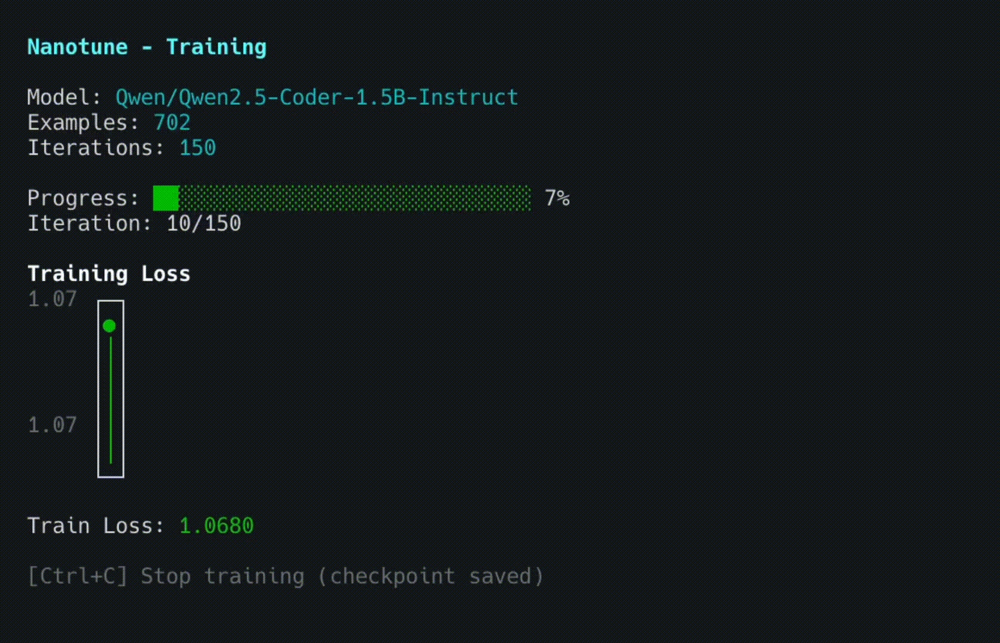

# Nanotune

A simple, interactive CLI for fine-tuning small language models on Apple Silicon — built by the [Nano Collective](https://nanocollective.org), a community collective building AI tooling not for profit, but for the community. Everything we build is open, transparent, and driven by the people who use it.

No YAML configs, no complex flags — just an interactive TUI that guides you through each step. Nanotune handles the MLX and llama.cpp tooling for you automatically.



---


## Quick Start

```bash
npm install -g @nanocollective/nanotune
nanotune init
nanotune data add
nanotune train
nanotune export
nanotune benchmark
```

Or run directly with npx:

```bash
npx @nanocollective/nanotune init
```

## Documentation

Full documentation is available online at **[docs.nanocollective.org](https://docs.nanocollective.org/nanotune/docs)** or in the [docs/](docs/) folder:

- **[Getting Started](docs/getting-started/index.md)** — Installation, requirements, and your first project
- **[Commands](docs/commands/index.md)** — Full reference for all CLI commands
- **[Guides](docs/guides/index.md)** — Training data, benchmarking, LLM judge, and tuning tips
- **[Configuration](docs/configuration/index.md)** — Project config, recommended models, and judge setup
- **[Community](docs/community.md)** — Contributing, Discord, and how to help

## Community

The Nano Collective is a community collective building AI tooling for the community, not for profit. We'd love your help.

- **Contribute**: See [CONTRIBUTING.md](CONTRIBUTING.md) for development setup and guidelines.
- **The collective**: [nanocollective.org](https://nanocollective.org) · [docs](https://docs.nanocollective.org) · [GitHub](https://github.com/Nano-Collective) · [Discord](https://discord.gg/ktPDV6rekE)
- **Support the work**: The [Support page](https://docs.nanocollective.org/collective/organisation/support) covers donations and sponsorship.
- **Paid contribution**: The [Economics Charter](https://docs.nanocollective.org/collective/organisation/economics-charter) sets out how scoped paid bounties work.
