# Nanotune — Testing Guide

> **Repo:** `addyCooks/nanotune` (fork of `Nano-Collective/nanotune`)  
> **Stack:** TypeScript · AVA · Biome · pnpm · Node ≥ 22

---

## Quick-Start

```bash
# 1. Install dependencies (one-time)
pnpm install

# 2. Run every check in one shot
pnpm test:all
```

---

## Test Suite Overview

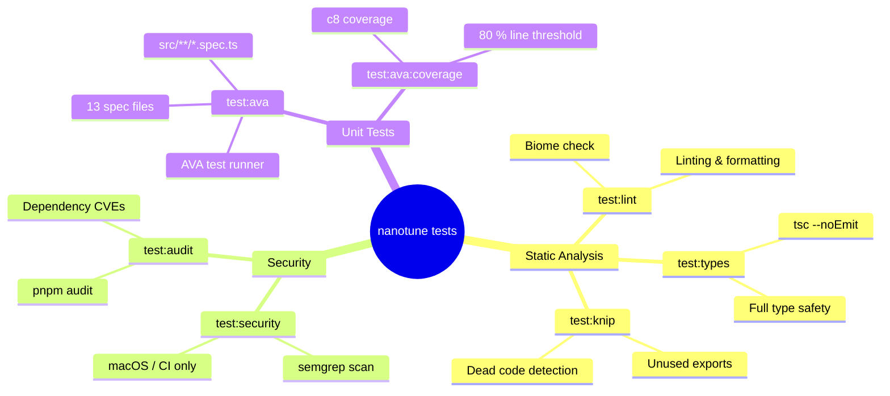

---

## Running Tests — Command Reference

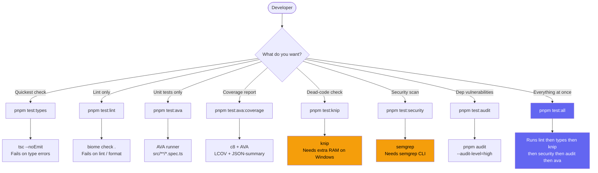

---

## Full `test:all` Pipeline

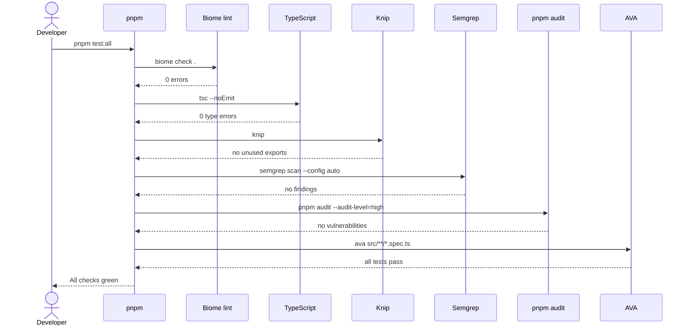

---

## Spec Files and What They Test

```mermaid
graph LR
    subgraph Matching
        BM[benchmark-match.spec.ts\n14 tests]
        BM -->|tests| BML[normalizeText\ncheckPass modes:\nexact contains\nstartsWith partial\nsemantic]
    end

    subgraph Benchmarking
        BU[benchmark-utils.spec.ts\n8 tests]
        BS[benchmark.spec.ts\n11 tests]
        BU -->|tests| BUL[buildMessages\ngetTestDisplayPrompt\nformatConversationForJudge]
        BS -->|tests| BSL[BENCHMARK_PRESETS\nlow medium high ultra\nPresetConfig types]
    end

    subgraph Chat
        CH[chat-helpers.spec.ts\n18 tests]
        CH -->|tests| CHL[parseSlashCommand\nbuildServerOptions\nbuildGenerateOptions]
    end

    subgraph MLX
        ML[mlx.spec.ts\n4 tests]
        ML -->|tests| MLL[Output regex parsing\nTrainingProgress\nMLXTrainingOptions]
    end

    subgraph Platform
        PL[platform.spec.ts\n5 tests]
        PL -->|tests| PLL[isSupportedPlatform\nassertSupportedPlatform\nunsupportedPlatformMessage]
    end

    subgraph TTY
        TT[tty.spec.ts\n6 tests]
        TT -->|tests| TTL[supportsRawMode\ninteractiveRequiredMessage]
    end

    subgraph Environment
        EV[env-substitution.spec.ts\n14 tests]
        EV -->|tests| EVL[substituteEnvVars\nbraced unbraced\ndefaults nested objects]
    end

    subgraph Judge
        JT[judge-templates.spec.ts\n9 tests]
        JD[judge.spec.ts\n15 tests]
        JT -->|tests| JTL[PROVIDER_TEMPLATES\nbuildConfig per provider]
        JD -->|tests| JDL[resolveCriteria\nbuildJudgePrompt\nparseJudgeResponse\nsaveJudgeConfig]
    end

    subgraph LlamaCPP
        LC[llama-cpp.spec.ts\n18 tests]
        LC -->|tests| LCL[parseLlamaCppStderr\nparseChatCompletionResponse\nInferenceOptions]
    end

    subgraph Filesystem
        DA[data.spec.ts\n50+ tests]
        CF[config.spec.ts\n15 tests]
        DA -->|tests| DAL[appendToTrainingData\nloadTrainingData\nimportFromCSV JSON JSONL\nsplitTrainValidation]
        CF -->|tests| CFL[ConfigSchema validation\ncreateDefaultConfig\nresolveContextMessage\nfindLatestGGUF]
    end
```

---

## Test Results on This Machine

> Tested on: **Windows 11 · Node v22 · pnpm 11 · repo on OneDrive**

| Spec File | Tests | Status | Notes |
|-----------|------:|--------|-------|
| `benchmark-match.spec.ts` | 14 | ✅ ALL PASS | |
| `benchmark-utils.spec.ts` | 8 | ✅ ALL PASS | |
| `benchmark.spec.ts` | 11 | ✅ ALL PASS | |
| `chat-helpers.spec.ts` | 18 | ✅ ALL PASS | |
| `env-substitution.spec.ts` | 14 | ✅ ALL PASS | |
| `judge-templates.spec.ts` | 9 | ✅ ALL PASS | |
| `llama-cpp.spec.ts` | 18 | ✅ ALL PASS | |
| `mlx.spec.ts` | 4 | ✅ ALL PASS | |
| `platform.spec.ts` | 5 | ✅ ALL PASS | |
| `tty.spec.ts` | 6 | ✅ ALL PASS | |
| `judge.spec.ts` | ~15 | ⚠️ 2 FAIL | Windows: `chmod 0o600` not enforced (by design) |
| `data.spec.ts` | 50+ | ❌ EBUSY | OneDrive locks temp dirs during `rmSync` |
| `config.spec.ts` | ~15 | ❌ EBUSY | OneDrive locks temp dirs during `rmSync` |

**Other checks:**

| Check | Status | Notes |
|-------|--------|-------|
| `test:types` | ✅ PASS | Zero TypeScript errors |
| `test:lint` | ✅ PASS | Fixed 37 CRLF files with `pnpm format` |
| `test:audit` | ✅ PASS | No known vulnerabilities |
| `test:knip` | ❌ OOM | `RangeError: Array buffer allocation failed` — needs extra heap |
| `test:security` | ⚠️ SKIP | semgrep CLI not installed on Windows |

---

## Windows / OneDrive Known Limitations

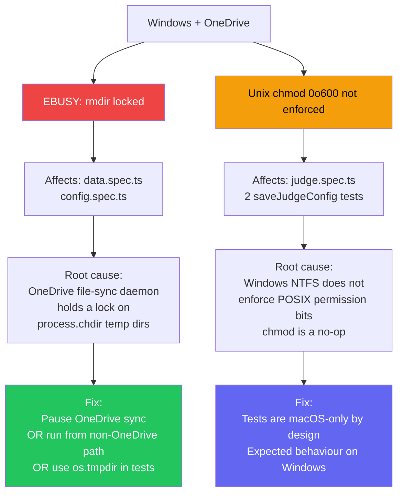

### Quick fix — run only Windows-safe tests

```bash
pnpm ava \
  src/lib/benchmark-match.spec.ts \
  src/lib/benchmark-utils.spec.ts \
  src/lib/benchmark.spec.ts \
  src/lib/chat-helpers.spec.ts \
  src/lib/env-substitution.spec.ts \
  src/lib/judge-templates.spec.ts \
  src/lib/llama-cpp.spec.ts \
  src/lib/mlx.spec.ts \
  src/lib/platform.spec.ts \
  src/lib/tty.spec.ts
```

---

## Coverage Report Workflow

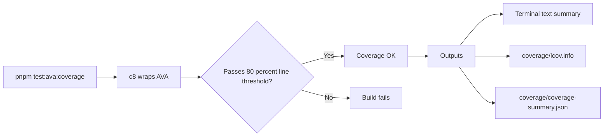

```bash
# Run coverage and generate HTML report
pnpm test:ava:coverage
# Output written to ./coverage/
```

---

## Lint / Format Workflow

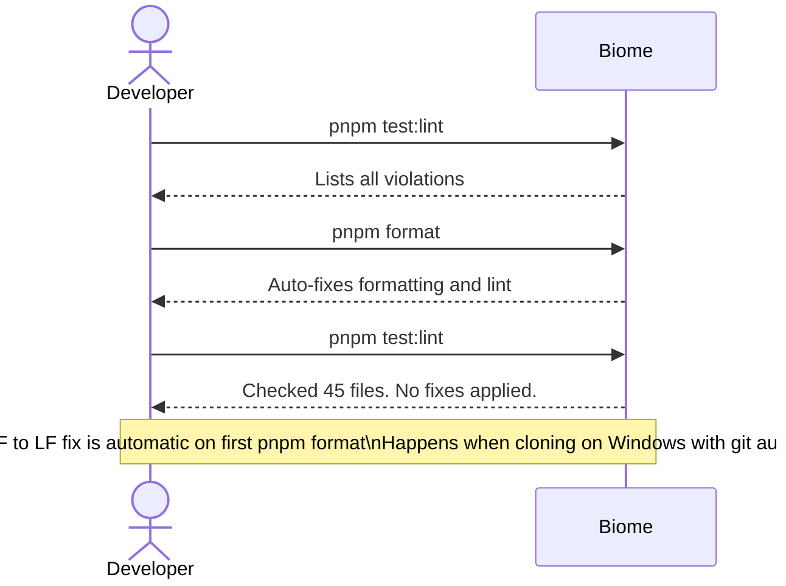

---

## Static Analysis Details

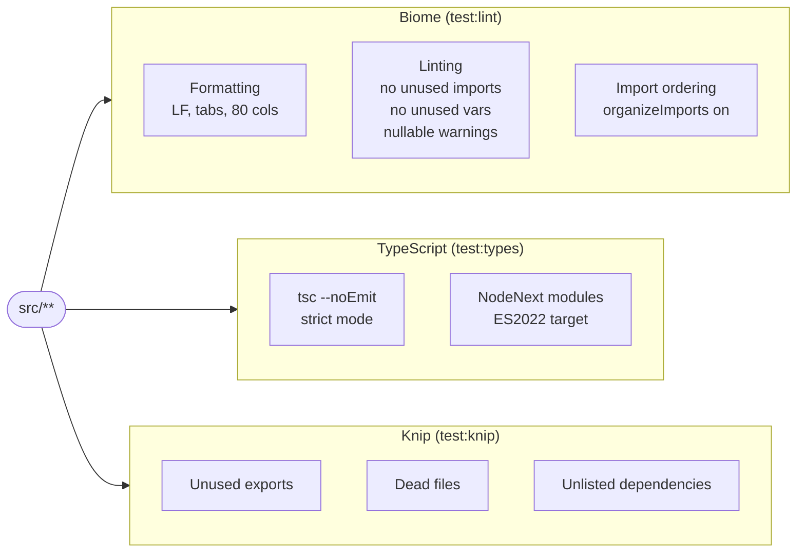

> **Knip on Windows:** If you get `RangeError: Array buffer allocation failed`, run:
> ```bash
> node --max-old-space-size=4096 node_modules/.bin/knip
> ```

---

## Security Checks

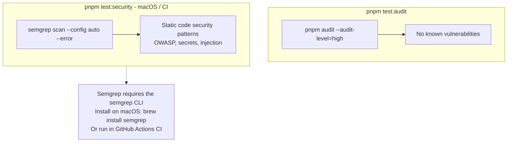

---

## CI / GitHub Actions Flow

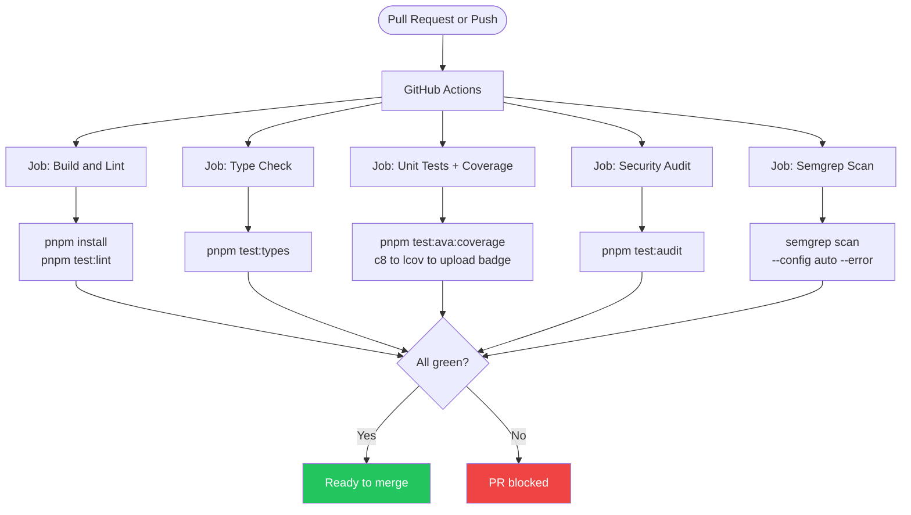

---

## Fork / Remote Workflow

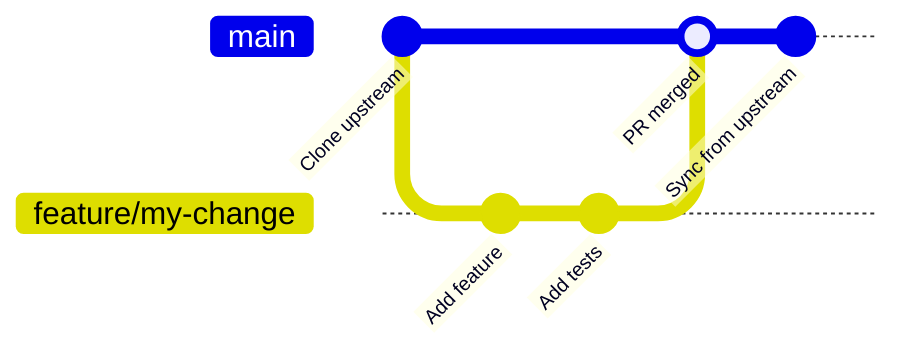

```bash
# Remotes configured for this fork
git remote -v
# origin    https://github.com/addyCooks/nanotune   (your fork)
# upstream  https://github.com/Nano-Collective/nanotune  (source)

# Keep your fork in sync with upstream
git fetch upstream
git rebase upstream/main
git push origin main
```

---

## Spec File Dependency Map

```mermaid
graph TD
    subgraph Types["src/types/index.ts"]
        TY[ConfigSchema\nBenchmarkPreset\nPresetConfig\nTrainingExample\nMatchMode]
    end

    subgraph Lib["src/lib/"]
        BM[benchmark-match.ts]
        BU[benchmark-utils.ts]
        CH[chat-helpers.ts]
        CF[config.ts]
        DA[data.ts]
        EV[env-substitution.ts]
        JT[judge-templates.ts]
        JD[judge.ts]
        LC[llama-cpp.ts]
        ML[mlx.ts]
        PL[platform.ts]
        TT[tty.ts]
    end

    subgraph Specs["spec files"]
        SM[benchmark-match.spec.ts] --> BM
        SU[benchmark-utils.spec.ts] --> BU
        SB[benchmark.spec.ts] --> TY
        SC[chat-helpers.spec.ts] --> CH
        SF[config.spec.ts] --> CF
        SF --> TY
        SD[data.spec.ts] --> DA
        SD --> TY
        SE[env-substitution.spec.ts] --> EV
        SJT[judge-templates.spec.ts] --> JT
        SJD[judge.spec.ts] --> JD
        SL[llama-cpp.spec.ts] --> LC
        SML[mlx.spec.ts] --> ML
        SP[platform.spec.ts] --> PL
        ST[tty.spec.ts] --> TT
    end
```

---

*Generated by Antigravity · addyCooks/nanotune fork · August 2026*
